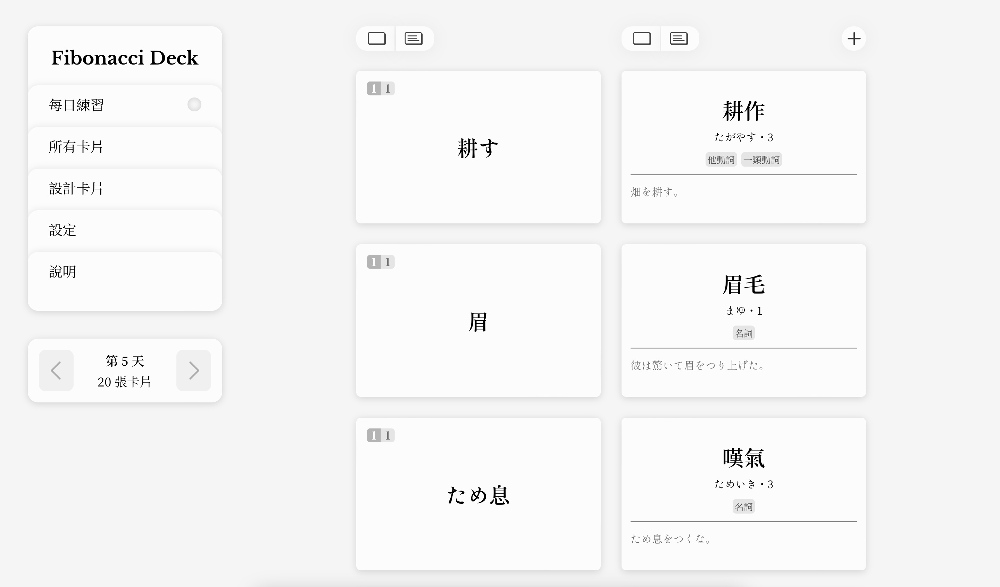

# Fibonacci Deck

Fibonacci Deck 是一款應用了費波那契數列的學習工具。當你新增一張紀錄著單字資訊的「卡片」，這張卡片便會依次在第 1、2、3、5、8、13⋯⋯天時出現。隨著複習次數增加，複習的間隔也會拉長，最終成為不易丟失的長期記憶。

本專案只是一個實驗，並沒有實作資料庫、帳號驗證等機制，功能方面也僅有基本的新增卡片、翻牌、切換日期等，介面亦無響應式支援。

網站僅有中文介面，使用例為中文母語者製作的日文單詞卡，故欄位也只有針對日文學習者設計。

Fibonacci Deck is a learning tool that utilizes the Fibonacci sequence. When you add a card with new vocabulary on it, it will reappear on the 1st, 2nd, 3rd, 5th, 8th, 13th, and so on days. The more it reappears, the intervals between reappearances will also lengthen, eventually forming long-term memories.

This project is just an experiment and does not implement complex mechanisms such as database or account verification. Its functionality is limited to basic stuff like adding cards, flipping cards, switching dates, etc. Responsive interface is not supported.

The website only has a Chinese user interface. Fields on the cards are currently designed for Japanese learners specifically.



## 如何開啟 How to Run
在 clone 完專案資料夾後：

After cloning the repository:

```
npm run install-all
npm run dev
```

## 如何使用 How to Use
在「每日練習」分頁中，可以看到所有今天須進行複習的卡片。左右欄分別為卡片的正面及背面。透過點擊卡片或頁面上方的按鈕，可以將卡片覆蓋以方便背誦（卡片覆蓋在 Safari 瀏覽器中可能會有問題）。點擊頁面右上方的按鈕，可以新增卡片。

卡片正面的左上角有兩個數字，左邊代表卡片的等級，右邊則是這張卡片下次會在幾天後出現。今天才新增的卡片等級為 1，隨著每一次出現，卡片會慢慢升級，下次出現的時間也會愈來愈長。

In the "每日練習" page, you can see all the cards that need to be reviewed today. The left and right columns respectively show the front and back of the cards. By clicking on a card or the buttons at the top of the page, you can cover the card for easier memorization (you may encounter issues using Safari). Clicking the button in the upper right corner of the page allows you to add a new card.

In the top left corner of the card's front, there are two numbers. The number on the left represents the current level of the card, while the number on the right indicates how many days until this card reappears. Newly added cards start at level 1, and with each reappearance, the cards will gradually level up, and the time until the next appearance will become longer.
